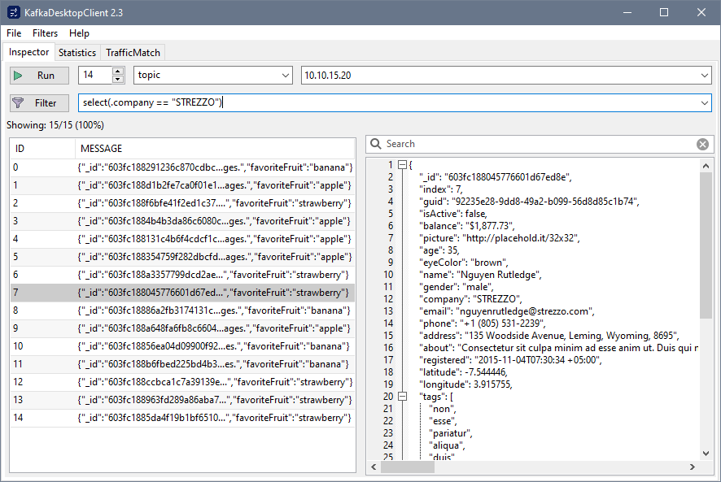
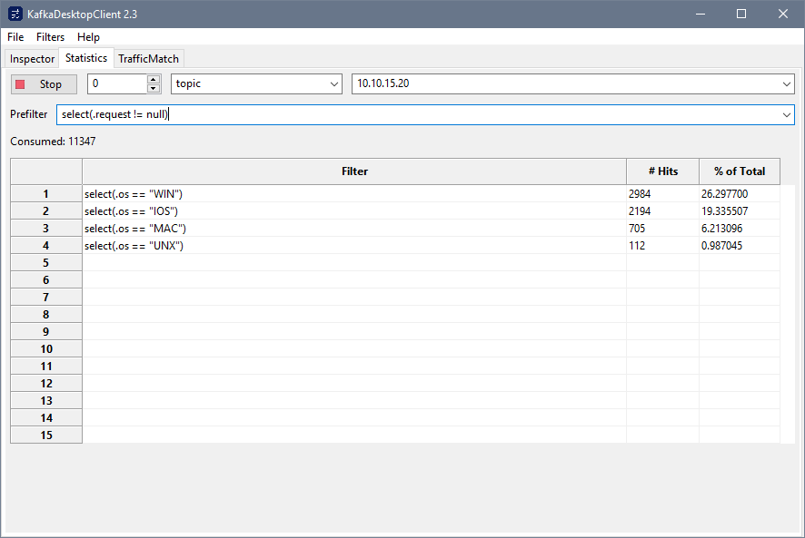
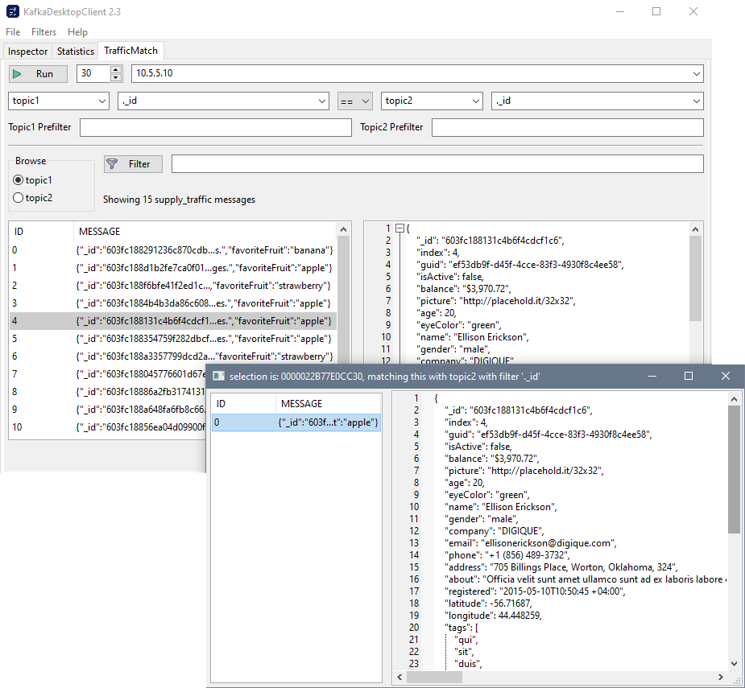

# Kafka Desktop Client

The Kafka Desktop Client is a cross-platform desktop application that consumes, analyzes, and inspects Kafka messages in json format. Using a flexible set of tools, you can quickly and easily browse and filter messages, gather statistics, and scan and match traffic from different topics.
To begin using the Kafka Desktop Client:
1. [Download the latest version of the client for your operating system.](#Install)
2. Unzip the file and run **KafkaDesktopClient** executable

# Features

## Inspector: View and filter Kafka messages

On the `Inspector` tab, you can consume messages from kafka topics and browse them.

To view and filter messages:
1. Select the number of messages that you want to see.
2. Specify the Kafka topic.
3. Click `Run` to begin collecting messages in the buffer.
4. After collecting messages, specify a `jq` filter that you want to apply.
5. Click the `Filter` button to apply this filter.
6. To see the details for an individual message, click on the message.

In the screenshot below, the filter `select(.company == "STREZZO")` is applied and it will show messages that match the company name.


## Statistics: View filtered statistics

On the `Statistic` tab, you can create filters to gather specific statistics by using `jq` filters. For more information on the `jq` filters that you can use, [see the JQ filter support section](#jq).

1. Select the number of messages that you want limit to. If you select **0**, messages will be consumed until you click **Stop**.
2. Select the kafka topic.
3. Optionally, create a prefilter if you want to limit the results that are shown.
4. In the **Filter** section, create the `jq` filters for the statistic you want to see.

In the screenshot below, there is a total count filtering by operating systems, for example, `select(.os == "WIN")`



# Traffic Match: match traffic from two topics

In the `Traffic Match` tab, you can monitor two Kafka topics simultaneously and search for matching messages based on specified filters.

The screenshot below lists all message of `topic1` and `topic2` matched if their ids are equal. Double-clicking on a message will bring up a window showing all matched message with the same `._id`.




# <a name="Install">Install</a>

Version | Linux | macOS | Windows
:------:|:-------:|:-------:|:-------:
2.3  | [Ubuntu]() | [catalina, mojave]() | [Windows 10]()

# Changelog 

Version                    |  Description
:-------------------------:|:--------------------------
2.3 | Initial opensource release

# <a name="jq">JQ filter support</a>

A list of all unit tests can be found [here](test/jq_test.cpp). A few examples are listed below.

```bash
# Field access
.company
.team.members

# Array access
.team.members[0]
.team.members[0].name   # from json object team, first index of array memebrs, show name key

# Piping intermediary result to next filter
.team | .members[0] | .name

# Regex(<expr no quotes>), return matched strings, otherwise empty
# Can be applied to any object (not just string)
regex(page.*www.yahoo.com)

# Contains(<string no quotes>), return bool if string is found otherwise false
# Can be applied to any object (not just string)
contains(msn.com)    

# Select
select(.errno != null)      # is not null
select(.errno == null)      # is null
select(.country == "US") | .company

select(.team.members[1])         # members[1] not null, same as select(.team.members[1] != null)
select(.team.members[1] | contains(Fan))

# Other examples
select(regex(page.*www.yahoo.com)) | .company
select(.country == "US" and .team.members[0].name == "Bob")

# Comparison
select(.age > 90)    
select(.age != 25)    # equivalent to select(.age == 25 | not) 
select(.number >= 500 and .age > 90)
```


# Build from source

#### In short
On all OSs, need to install a package manager called vcpkg, which will fetch the required libraries and compile them locally. Windows/Macos are all handled by vcpkg  but for linux there is a separate (simple) step for the GUI library. Below are the IDEs which were tested and working correctly: 
Linux/macos:  Visual Studio Code + Cmake extension
Windows: Visual Studio Community

#### Instructions
```bash

# get the package manager
cd /opt
git clone git@github.com:microsoft/vcpkg.git
cd vcpkg
./bootstrap.sh # linux, macos
bootstrap.bat  # windows

# Kafka libs
vcpkg install "librdkafka[zlib]"  # linux, macos 
vcpkg install librdkafka[zlib]  # windows 
vcpkg install cppkafka

# Json libs
vcpkg install rapidjson
vcpkg install nlohmann-json

# next line: linux only
./vcpkg.sh install ncurses 

# Misc
vcpkg install xlnt

# Cross-platform GUI libs wxWidgets
# Next line: only for windows and macos
vcpkg install wxwidgets

# Nxt lines: only for Linux:
# [ref link](https://www.binarytides.com/install-wxwidgets-ubuntu/)
# Go to wxwidgets.org and download source files (eg. https://www.wxwidgets.org/downloads/)
# Extract the files to a directory and open a shell inside the directory
sudo apt-get install libgtk-3-dev build-essential checkinstall
mkdir gtk-build
cd gtk-build/
../configure --disable-shared --enable-unicode
make
sudo checkinstall
```

## Linux
```bash
mkdir build
cd build
cmake ../ "-DCMAKE_BUILD_TYPE=Release" "-DCMAKE_TOOLCHAIN_FILE=/opt/vcpkg/scripts/buildsystems/vcpkg.cmake"
cmake --build . --parallel 8
```

## MacOS
```bash
mkdir build
cd build
cmake .. "-DCMAKE_BUILD_TYPE=Release" "-DCMAKE_TOOLCHAIN_FILE=/opt/vcpkg/scripts/buildsystems/vcpkg.cmake" "-DwxWidgets_CONFIG_EXECUTABLE=/opt/vcpkg/installed/x64-osx/tools/wxwidgets/wx-config"
cmake --build . --parallel 8
```

## Win10

With Visual Studio, open `.sln` file then Build->Build Solution.


When building on Win10, you might need to make an additional modification to `rdkafka.h` library from `vcpkg\installed\x86-windows\include\librdkafka\rdkafka.h`, replace the following:
```cpp
typedef SSIZE_T ssize_t;
```
with
```cpp
#ifndef _SSIZE_T
typedef SSIZE_T ssize_t;
#endif
```

## Constributing 
All contributions are welcome.

## License
Apache 2.0